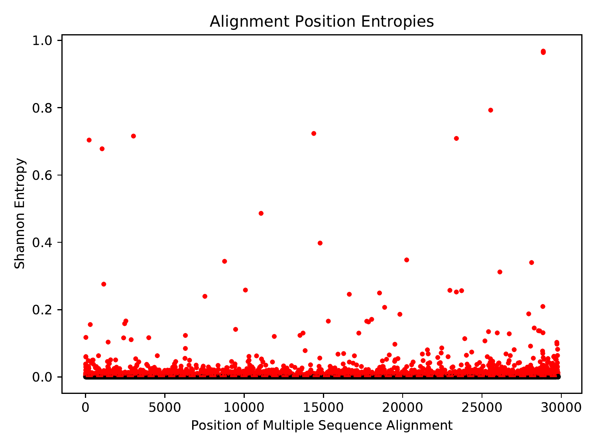

# ViReport v0.0.1 &mdash; 2020-04-18

## Input Dataset
The analysis was conducted on a dataset containing 9350 sequences. The average sequence length was 29858.111, with a standard deviation of 75.69. The earliest sample date was 2019-12-24, the median sample date was 2020-03-18, and the most recent sample date was 2020-04-17.

<figure>

<figcaption>Distribution of input sequence lengths</figcaption>
</figure>

<figure>

<figcaption>Distribution of input sample dates</figcaption>
</figure>

<figure>

<figcaption>Distribution of input sample categories</figcaption>
</figure>

## Preprocessed Dataset
The input dataset was preprocessed such that sequences were given safe names: non-letters/digits in sequence IDs were converted to underscores. After preprocessing, the dataset contained 9350 sequences. The average sequence length was 29858.111, with a standard deviation of 75.69. The earliest sample date was 2019-12-24, the median sample date was 2020-03-18, and the most recent sample date was 2020-04-17.

<figure>

<figcaption>Distribution of preprocessed sequence lengths</figcaption>
</figure>

<figure>

<figcaption>Distribution of preprocessed sample dates</figcaption>
</figure>

<figure>

<figcaption>Distribution of preprocessed sample categories</figcaption>
</figure>

## Multiple Sequence Alignment
Multiple sequence alignment was performed using Minimap2 (Li, 2018). Each input sequence was aligned to the reference sequence (MT072688), and the multiple sequence alignment was constructed based on positions in the reference. There were 29808 positions (64 invariant) and 7763 unique sequences in the multiple sequence alignment. Pairwise distances were computed from the multiple sequence alignment using the tn93 tool of HIV-TRACE (Pond et al., 2018). The average pairwise sequence distance was 0.000312, with a standard deviation of 0.000154.

<figure>

<figcaption>Distribution of pairwise sequence distances</figcaption>
</figure>

Across the positions of the multiple sequence alignment, the minimum coverage was 0.274, the maximum coverage was 0.998, and the average coverage was 0.964, with a standard deviation of 0.039.

<figure>

<figcaption>Coverage (proportion of non-gap characters) across the positions of the multiple sequence alignment</figcaption>
</figure>

 Across the positions of the multiple sequence alignment that had non-zero Shannon entropy, the minimum Shannon entropy was 0.00157, the maximum Shannon entropy was 1.0145, and the average Shannon entropy was 0.00659, with a standard deviation of 0.0395.

<figure>

<figcaption>Shannon entropy across the positions of the multiple sequence alignment. Due to the abundance of zero-entropy positions, all non-zero entropies were deemed significant. The significance threshold is shown as a red dashed line, and significant points are shown in red.</figcaption>
</figure>

## Phylogenetic Inference
A maximum-likelihood phylogeny was inferred under the General Time-Reversible (GTR) model (Tavare, 1986) using FastTree 2 (Price et al., 2010) using a Gamma20-based likelihood. The inferred phylogeny was MinVar-rooted using FastRoot (Mai et al., 2017). The tree was too large to draw.
## Phylogenetic Dating
The rooted phylogeny was dated using treedater (Volz & Frost, 2017). The height of the dated tree was 122.862 days, so given that the most recent sample was collected on 2020-04-17, the estimated time of the most recent common ancestor (tMRCA) was 2019-12-16. The tree was too large to draw.
## Citations

* Le S.Q., Gascuel O. (2008). "An Improved General Amino Acid Replacement Matrix". Molecular Biology and Evolution. 25(7), 1307-1320.
* Li H. (2018). "Minimap2: pairwise alignment for nucleotide sequences". Bioinformatics. 34(18), 3094-3100.
* Mai U., Sayyari E., Mirarab S. (2017). "Minimum Variance Rooting of Phylogenetic Trees and Implications for Species Tree Reconstruction". PLoS ONE. 12(8), e0182238.
* Moshiri N. (2020). "ViReport" (https://github.com/niemasd/ViReport).
* Pond S.L.K., Weaver S., Leigh Brown A.J., Wertheim J.O. (2018). "HIV-TRACE (TRAnsmission Cluster Engine): a Tool for Large Scale Molecular Epidemiology of HIV-1 and Other Rapidly Evolving Pathogens". Molecular Biology and Evolution. 35(7), 1812-1819.
* Price M.N., Dehal P.S., Arkin A.P. (2010). "FastTree 2 -- Approximately Maximum-Likelihood Trees for Large Alignments". PLoS ONE. 5(3), e9490.
* Tavare S. (1986). ""Some Probabilistic and Statistical Problems in the Analysis of DNA Sequences". Lectures on Mathematics in the Life Sciences. 17, 57-86.
* Volz E.M., Frost S.D.W. (2017). "Scalable relaxed clock phylogenetic dating". Virus Evolution. 3(2), vex025.

