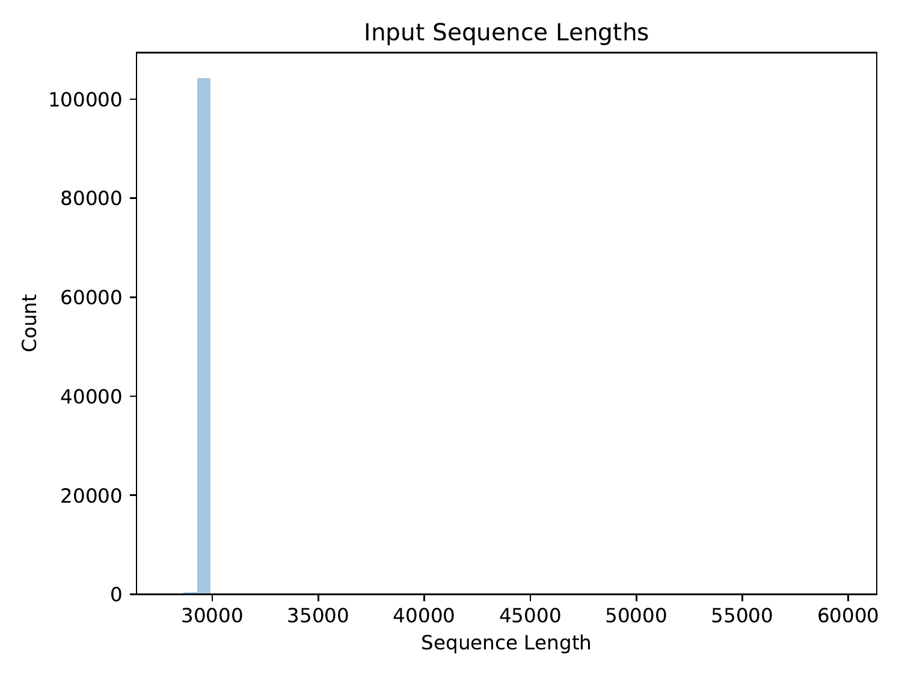
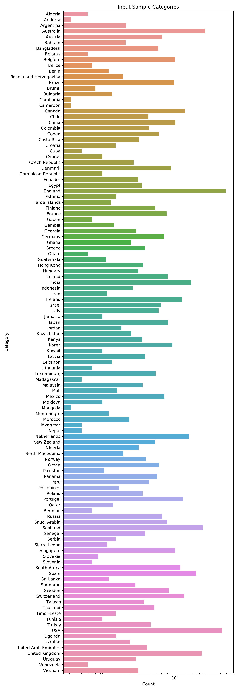
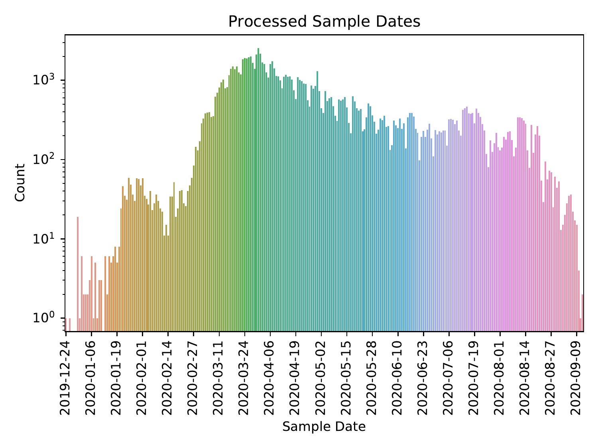
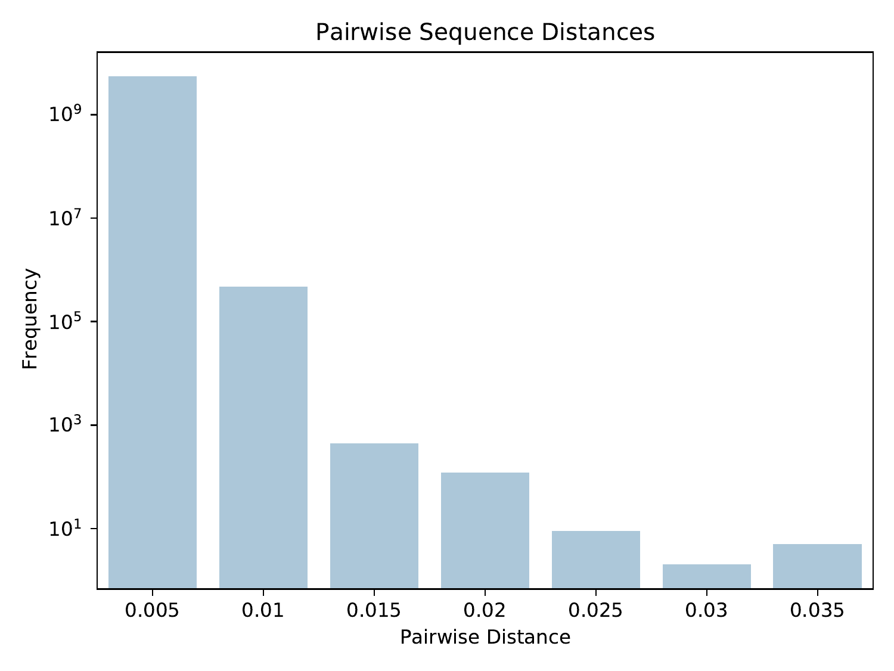
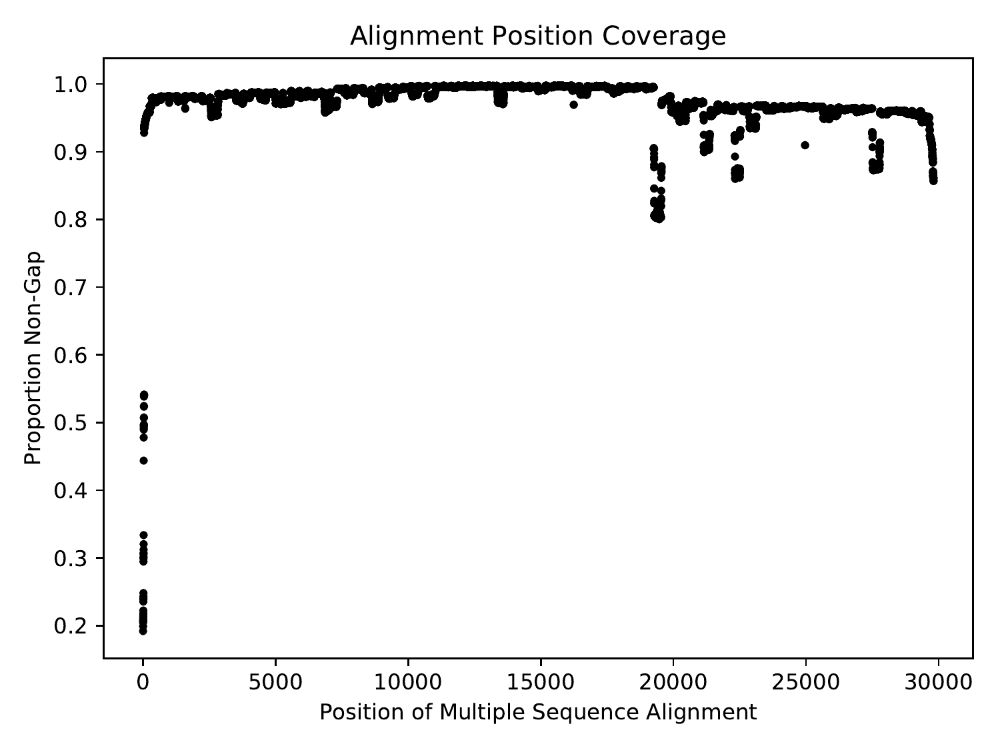

# ViReport v0.0.1 &mdash; 2020-06-12

## Input Dataset
The analysis was conducted on a dataset containing 45232 sequences. The average sequence length was 29854.485, with a standard deviation of 85.374. The earliest sample date was 2010-03-12, the median sample date was 2020-03-31, and the most recent sample date was 2020-06-02.

<figure>

<figcaption>Distribution of input sequence lengths</figcaption>
</figure>

<figure>

<figcaption>Distribution of input sample dates</figcaption>
</figure>

<figure>

<figcaption>Distribution of input sample categories</figcaption>
</figure>

## Preprocessed Dataset
The input dataset was preprocessed such that sequences were given safe names: non-letters/digits in sequence IDs were converted to underscores. After preprocessing, the dataset contained 45232 sequences. The average sequence length was 29854.485, with a standard deviation of 85.374. The earliest sample date was 2010-03-12, the median sample date was 2020-03-31, and the most recent sample date was 2020-06-02.

<figure>

<figcaption>Distribution of preprocessed sequence lengths</figcaption>
</figure>

<figure>

<figcaption>Distribution of preprocessed sample dates</figcaption>
</figure>

<figure>

<figcaption>Distribution of preprocessed sample categories</figcaption>
</figure>

## Multiple Sequence Alignment
Multiple sequence alignment was performed using Minimap2 (Li, 2018). Each input sequence was aligned to the reference sequence (MT072688), and the multiple sequence alignment was constructed based on positions in the reference. There were 29808 positions (2 invariant) and 37761 unique sequences in the multiple sequence alignment. Pairwise distances were computed from the multiple sequence alignment using the tn93 tool of HIV-TRACE (Pond et al., 2018).

<figure>

<figcaption>Distribution of pairwise sequence distances</figcaption>
</figure>

Across the positions of the multiple sequence alignment, the minimum coverage was 0.219, the maximum coverage was 0.998, and the average coverage was 0.968, with a standard deviation of 0.0409.

<figure>

<figcaption>Coverage (proportion of non-gap characters) across the positions of the multiple sequence alignment</figcaption>
</figure>

 Across the positions of the multiple sequence alignment that had non-zero Shannon entropy, the minimum Shannon entropy was 0.000375, the maximum Shannon entropy was 0.875, and the average Shannon entropy was 0.00273, with a standard deviation of 0.0214.

<figure>

<figcaption>Shannon entropy across the positions of the multiple sequence alignment. A significance threshold was computed using Tukey's Rule: 1.5x the interquartile range added to the third quartile, which was 0.00267. The significance threshold is shown as a red dashed line, and significant points are shown in red.</figcaption>
</figure>

## Phylogenetic Inference
Phylogenetic inference was not performed. Phylogenetic rooting was not performed.
## Phylogenetic Dating
Phylogenetic dating was not performed.
## Citations

* Li H. (2018). "Minimap2: pairwise alignment for nucleotide sequences". Bioinformatics. 34(18), 3094-3100.
* Moshiri N. (2020). "ViReport" (https://github.com/niemasd/ViReport).
* Pond S.L.K., Weaver S., Leigh Brown A.J., Wertheim J.O. (2018). "HIV-TRACE (TRAnsmission Cluster Engine): a Tool for Large Scale Molecular Epidemiology of HIV-1 and Other Rapidly Evolving Pathogens". Molecular Biology and Evolution. 35(7), 1812-1819.

